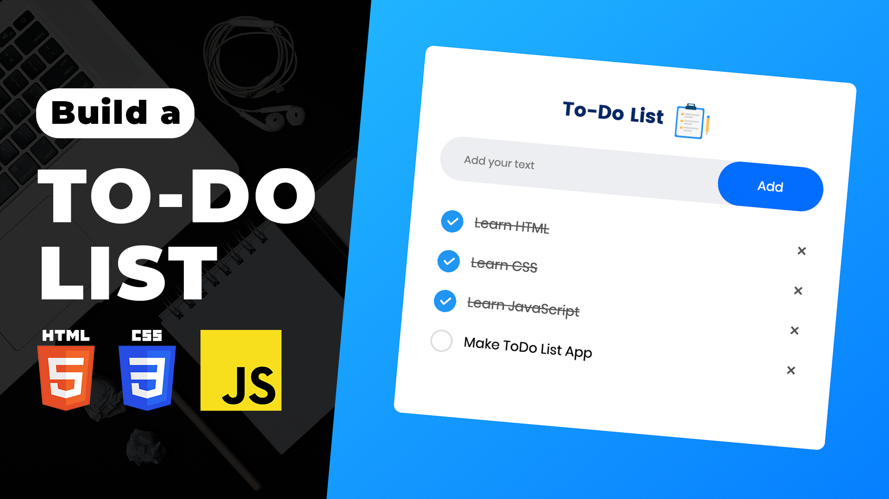

# Build a Todo List App using HTML CSS & JavaScript | JavaScript for Beginners Tutorial

The "Build a Todo List App" tutorial is designed for JavaScript beginners, providing a hands-on experience in creating a simple yet functional task management application using HTML, CSS, and JavaScript. This beginner-friendly project walks through the process of constructing a Todo List with a clean and intuitive user interface. The tutorial covers essential concepts such as DOM manipulation, event handling, and basic styling using HTML and CSS.

By following this guide, beginners can gain practical insights into JavaScript development while creating a useful and interactive application. The Todo List App project serves as an ideal starting point for those looking to strengthen their foundational skills and understand how JavaScript can be applied to real-world projects.

Youtube Tutorial Link: https://youtu.be/f-x2E68JH_4

